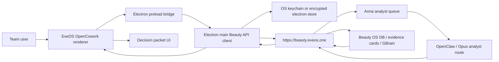

# EveOS OpenCowork Client Design Spec

Date: 2026-06-23

## Goal

Fork and adapt `OpenCoworkAI/open-cowork` into an EveOS / Anna Beauty OS team
client for BANILA CO and future beauty brand work.

The client should let team members use Anna Beauty OS / Beauty KB / GBrain /
OpenClaw analyst queue without Tailscale or direct Anna machine access. It must
make evidence-backed product planning easier: product renewal, why a product is
winning, market follow-up, claim and hook generation, ad angle review, and
cited decision packets.

This document is the pre-implementation spec. It intentionally does not change
Anna canonical data or start a major fork implementation.

## Design Read

Reading this as: an internal beauty intelligence cockpit for product planners,
marketers, and leadership, with a refined BANILA CO / F&CO operational language,
leaning toward a quiet desktop app with exact evidence surfaces rather than a
generic AI chat dashboard.

Taste dials:

| Dial             | Value | Reason                                                                                  |
| ---------------- | ----: | --------------------------------------------------------------------------------------- |
| Design variance  |     5 | Existing OpenCowork UI should be preserved where useful; redesign should be targeted.   |
| Motion intensity |     2 | This is decision infrastructure, not a marketing page.                                  |
| Visual density   |     7 | Users need queue state, citations, evidence warnings, and market context on one screen. |

## Observed Facts

| Area                      | Fact                                                                                                                                                                                     | Evidence                                                                               |
| ------------------------- | ---------------------------------------------------------------------------------------------------------------------------------------------------------------------------------------- | -------------------------------------------------------------------------------------- |
| Upstream repo             | Upstream is `OpenCoworkAI/open-cowork`.                                                                                                                                                  | `gh repo view OpenCoworkAI/open-cowork`                                                |
| Upstream license          | License is MIT.                                                                                                                                                                          | `gh repo view OpenCoworkAI/open-cowork --json licenseInfo`                             |
| Upstream default branch   | Default branch is `main`.                                                                                                                                                                | `gh repo view OpenCoworkAI/open-cowork --json defaultBranchRef`                        |
| Upstream version          | `package.json` name is `open-cowork`, version `3.3.1`.                                                                                                                                   | `/Users/drake/.cache/codex/open-cowork-inspect/package.json`                           |
| Upstream stack            | Electron + Vite + React 18 + Tailwind v3 + Zustand + electron-store + better-sqlite3 + Vitest.                                                                                           | `/Users/drake/.cache/codex/open-cowork-inspect/package.json`                           |
| Upstream architecture     | `src/main`, `src/preload`, `src/renderer`, `src/shared`; renderer has `App.tsx`, `Sidebar.tsx`, `ChatView.tsx`, `SettingsPanel.tsx`; main has config, session, db, MCP, remote, sandbox. | `/Users/drake/.cache/codex/open-cowork-inspect/src`                                    |
| Upstream token storage    | Existing config persistence uses `electron-store` with encryption/key rotation helpers.                                                                                                  | `/Users/drake/.cache/codex/open-cowork-inspect/src/main/config/config-store.ts`        |
| OpenCowork remote surface | Shared IPC types include remote gateway auth, tunnel, Feishu/Telegram/WebSocket channel concepts.                                                                                        | `/Users/drake/.cache/codex/open-cowork-inspect/src/shared/ipc-types.ts`                |
| Beauty API base           | Public base URL is `https://beauty.eveos.one`.                                                                                                                                           | Existing team access docs and live curl verification                                   |
| Beauty health             | `GET https://beauty.eveos.one/health` returns HTTP `200`.                                                                                                                                | `curl -w '%{http_code}'` on 2026-06-23                                                 |
| Beauty protected endpoint | `GET https://beauty.eveos.one/tools` returns HTTP `401` without bearer token.                                                                                                            | `curl -w '%{http_code}'` on 2026-06-23                                                 |
| Beauty bearer auth        | `GET https://beauty.eveos.one/tools` returns HTTP `200` with the Anna Beauty API token.                                                                                                  | Token read from Anna and used without printing it                                      |
| Existing client-flow doc  | The current recommended MVP is question input -> intent brief preview -> run analyst -> answer page with citations -> saved run history.                                                 | `/Users/drake/Documents/New project/anna-beauty-team-access/opencowork-client-flow.md` |
| Existing concurrency doc  | Read-only lookup can support more users; Opus/max-thinking analyst execution should start at 1 active worker.                                                                            | `/Users/drake/Documents/New project/anna-beauty-team-access/concurrency.md`            |

## Inference

OpenCowork is a reasonable fork base because it already solves desktop app
packaging, settings, encrypted local config, session history, remote control
concepts, MCP concepts, and multi-model agent UI. The wrong path would be
turning the EveOS client into another raw agent chat. Anna already owns the
agent execution and Beauty KB access. The client should be a thin, team-safe
decision cockpit over the Beauty API and analyst queue.

The first fork should therefore add a Beauty OS product surface, not rewrite
OpenCowork's agent runner.

## Target Users

| User                     | Needs                                                                        | Permissions                                  |
| ------------------------ | ---------------------------------------------------------------------------- | -------------------------------------------- |
| Drake / admin            | Configure API, inspect queue, audit usage, view all runs.                    | Admin settings, all reports, queue controls. |
| Brand team user          | Ask brand/product questions and read cited answers.                          | Create runs, view own/team reports.          |
| Product planner          | Renewal strategy, concept whitespace, ingredient/package/promotion patterns. | Create runs, save packets, compare evidence. |
| Marketer / ad strategist | Claims, hooks, ad angles, creative evidence, market signals.                 | Create runs, export/share answer packets.    |
| Read-only viewer         | Read approved decision packets and evidence.                                 | No analyst queue submission by default.      |

## Product Principles

1. Evidence first: final answers must show observed facts before inference.
2. Queue honest: the UI must show slow analyst jobs as queued/running, not as a
   frozen chat.
3. No direct Anna access: all team use goes through `https://beauty.eveos.one`.
4. No token leaks: bearer tokens must never appear in renderer logs, exported
   reports, crash reports, screenshots, or IPC debug output.
5. Preserve upstream: keep OpenCowork's Electron, settings, session, and
   packaging architecture unless a direct conflict appears.
6. Taste restraint: avoid generic AI-purple SaaS, glassy blobs, huge hero
   layouts, and three-card feature rows. This is an operating console.

## Architecture



Recommended module layout inside the fork:

| Layer            | Proposed files                                                             | Purpose                                                                                                  |
| ---------------- | -------------------------------------------------------------------------- | -------------------------------------------------------------------------------------------------------- |
| Shared types     | `src/shared/beauty-api-types.ts`                                           | Request/response schemas for health, brief, run, result, queue, citations.                               |
| Main API client  | `src/main/beauty/beauty-api-client.ts`                                     | Performs HTTPS calls, applies auth header, redacts errors.                                               |
| Main config      | `src/main/beauty/beauty-config-store.ts` or extension of `config-store.ts` | Stores API base URL and token through existing encrypted store pattern.                                  |
| IPC handlers     | `src/main/beauty/beauty-ipc.ts`                                            | Exposes `beauty.health`, `beauty.intentBrief`, `beauty.startRun`, `beauty.answerResult`, `beauty.queue`. |
| Preload bridge   | `src/preload/index.ts` additions                                           | Exposes typed `window.electronAPI.beauty.*` methods.                                                     |
| Renderer service | `src/renderer/beauty/useBeautyApi.ts`                                      | React hook wrapping IPC calls, loading/error states, polling.                                            |
| Renderer state   | `src/renderer/store/beauty.ts` or merged store slice                       | Holds active brief/run/result/history filters.                                                           |
| Screens          | `src/renderer/components/beauty/*`                                         | Command desk, brief review, run detail, queue monitor, evidence panel, settings.                         |
| Tests            | `tests/beauty-api-client.test.ts`, `tests/beauty-renderer-state.test.ts`   | Auth redaction, queue polling, evidence contract rendering.                                              |

## API Contract

| Endpoint                    | Method   | Auth   | Client use                                               |
| --------------------------- | -------- | ------ | -------------------------------------------------------- |
| `/health`                   | GET      | No     | Gateway availability badge and settings connection test. |
| `/tools`                    | GET      | Bearer | Capability discovery; should not be on the hot path.     |
| `/intent-brief`             | POST     | Bearer | Build and preview the analyst prompt before queueing.    |
| `/analyst-run`              | POST     | Bearer | Submit a queued analyst run with `wait:false`.           |
| `/answer-result?run_id=...` | GET      | Bearer | Poll run status and fetch final answer.                  |
| `/analyst-queue?limit=...`  | GET      | Bearer | Queue monitor and admin triage.                          |
| `/source-coverage`          | GET      | Bearer | Optional coverage view by market/layer.                  |
| `/evidence-cards`           | GET      | Bearer | Optional evidence browse/search.                         |
| `/evidence-packet`          | GET/POST | Bearer | Optional packet preview for a brand/product/market.      |

All response handling must support:

- `status`: queued/running/succeeded/failed/unknown.
- `observed_facts`.
- `inference`.
- `citations` with `source_table`, `source_url` or `artifact_path`.
- `missing_data_warnings`.
- `confidence`.
- `next_recommended_action`.

Unknown fields should be preserved in a raw metadata panel for debugging.

## Core User Flow

1. User opens Beauty Command Desk.
2. User chooses market, brand, product, and decision type.
3. User asks a question in plain language.
4. Client calls `/intent-brief`.
5. Client renders the generated analyst prompt, recommended evidence layers,
   missing data warnings, and estimated queue behavior.
6. User edits or approves the prompt.
7. Client calls `/analyst-run` with `wait:false`.
8. Client shows queue position/state and polls `/answer-result`.
9. When done, client renders an answer with tabs:
   - Summary
   - Observed facts
   - Inference
   - Evidence cards/citations
   - Missing data
   - Confidence and next action
10. User saves the result as a decision packet.

## Required Screens

| Screen                  | Purpose                                                              | Key states                                                                        |
| ----------------------- | -------------------------------------------------------------------- | --------------------------------------------------------------------------------- |
| Beauty setup            | Configure API base URL, token, health check, Cloudflare Access note. | Empty, validating, valid, invalid, token missing.                                 |
| Beauty command desk     | Primary question workspace.                                          | Empty, draft, brief loading, brief ready, validation error.                       |
| Prompt brief review     | Make the "right prompt" explicit before analyst work.                | Editable prompt, missing data warnings, evidence-layer checklist.                 |
| Analyst run detail      | Follow one run from queued to final answer.                          | Queued, running, succeeded, failed, timed out, canceled if endpoint exists later. |
| Queue monitor           | Admin/team view of current queue.                                    | Empty queue, one active worker, backlog, failures.                                |
| Evidence panel          | Citation browser tied to the current answer.                         | Source table, URL/artifact, confidence, missing source warning.                   |
| Brand/product workspace | Historical packets by market/brand/product.                          | Filters, saved packets, no history, stale data warning.                           |
| Saved reports/history   | Browse decisions over time.                                          | Search, market tabs, export/share.                                                |
| Admin/settings          | API, access policy, local retention, log redaction, diagnostics.     | Health, auth failed, version/capability mismatch.                                 |

## Taste and Visual System

Use the existing OpenCowork UI as the base, then retheme toward BANILA CO /
F&CO. This should feel like a refined internal operating system, not a consumer
landing page.

### Palette

| Role                       | Color                                                                     |
| -------------------------- | ------------------------------------------------------------------------- |
| Page background            | `#FFF8F3` cream or a slightly neutralized variant for long work sessions. |
| Primary accent             | `#D4717A` rose.                                                           |
| Hover/active accent        | `#B94E58` rose deep.                                                      |
| Quiet surface              | `#F5DDD6` blush light at low opacity, or neutral surface.                 |
| Text                       | `#2B2B2B` charcoal.                                                       |
| Secondary text             | `#4A4A4A` graphite.                                                       |
| Optional semantic line cue | `#A8BFA0` sage for clean/ingredient contexts only.                        |

Avoid:

- AI-purple/blue gradients.
- Neon accents.
- Pure black.
- Too many brand colors on one screen.
- Cute/kitsch/girly language.
- Decorative blobs and glass effects.

### Typography

Use the upstream stack unless adding fonts is low-risk. For the first PR:

- Keep system/Pretendard-compatible sans-serif for UI density.
- Use tabular figures for queue numbers, freshness timestamps, counts, and confidence.
- Avoid display-serif styling in the cockpit. BANILA campaign typography does not
  need to become the data app's default typography.
- Use compact labels and sentence case, not all-caps labels everywhere.

### Layout

- Prefer top-level workspace tabs plus a collapsible side rail over a heavy
  marketing sidebar.
- Avoid nested cards. Use panels, dividers, and evidence rows.
- Every status surface needs loading, empty, error, and stale states.
- The answer page should be split into answer body plus citation/evidence side
  panel on desktop, stacked on mobile/narrow windows.
- Do not hide missing data warnings. They are a product feature.

### Component Rules

| Component        | Rule                                                                           |
| ---------------- | ------------------------------------------------------------------------------ |
| Primary CTA      | Rose filled, short label: `Run analyst`, `Build brief`, `Save packet`.         |
| Secondary action | Text or quiet outline; do not duplicate primary intent.                        |
| Evidence cards   | Dense, source-attributed rows; no decorative card grid.                        |
| Queue state      | Always visible while a run is active.                                          |
| Error state      | Direct language: `Authentication failed`, `Run failed`, `Gateway unavailable`. |
| Loading state    | Skeletons matching final panels, no generic spinner-only screens.              |

## Security Plan

1. Store Beauty API token in the main process only.
2. Prefer OS keychain if upstream already has a stable helper; otherwise extend
   OpenCowork's encrypted `electron-store` pattern.
3. Renderer never receives the token.
4. IPC methods accept logical requests only; main process attaches the bearer
   token.
5. Redact `Authorization`, bearer tokens, Cloudflare tokens, cookies, and API
   keys from thrown errors and logs.
6. Settings screen may show token presence, last four characters only if needed,
   and "replace token"; it must not show the full token.
7. Cloudflare Access/email allowlist should be the recommended team gate before
   broad rollout.
8. Exports must include citations and missing data warnings, but never headers,
   secrets, or local Anna paths unless those paths are already intended
   artifacts from the Beauty API response.

## Data and Local Persistence

The fork should not duplicate Anna canonical data. It should store only client
state:

| Data                   | Local storage                                    | Notes                                                |
| ---------------------- | ------------------------------------------------ | ---------------------------------------------------- |
| API base URL           | Encrypted app config or normal config            | Non-secret but editable.                             |
| API token              | Encrypted store or OS keychain                   | Secret, main process only.                           |
| Run history cache      | Local SQLite/electron-store                      | Cache response metadata and result snapshots for UX. |
| Saved decision packets | Local DB initially; later team backend if needed | Include source IDs/citations.                        |
| User preferences       | Existing settings store                          | Theme, default market, default brand.                |

## Concurrency and Queue Behavior

Anna analyst execution should remain serialized by default. The client should
support many submitters but one active max-thinking analyst worker.

UI implications:

- When a run is queued, say it is queued.
- Show latest queue poll timestamp.
- Show stale queue warning if polling fails.
- Allow user to leave the screen and return to a run.
- Do not start duplicate analyst runs when the user refreshes.
- Future cancellation requires a server endpoint; until then, UI must not fake it.

## Fork Strategy

### Recommended fork name

`drake-agent/eveos-cowork`

### Recommended local path

`/Users/drake/Projects/eveos-cowork`

This avoids the dirty current workspace at:

`/Users/drake/Documents/New project`

### What to preserve

- Electron/Vite/React/Tailwind stack.
- Encrypted config store pattern.
- Session persistence and app shell.
- Existing packaging scripts.
- Existing settings panel conventions.
- Existing IPC/preload bridge pattern.
- Existing tests and Vitest setup.

### What to add

- Beauty API typed client.
- Beauty config/settings section.
- Beauty command desk screen.
- Prompt brief review screen.
- Analyst run detail and queue monitor.
- Evidence/citation answer renderer.
- Decision packet persistence.
- Taste-aligned theme tokens and app branding.

### What to avoid in first PR

- Replacing OpenCowork's agent runner.
- Direct OpenClaw invocation from the client.
- Direct Anna DB, GBrain, SSH, or Tailscale access.
- TikTok crawling.
- Apify.
- A broad rebrand of every upstream screen before the core Beauty flow works.
- Cloud sync or multi-user backend inside the client.

## Implementation Phases

### Phase 0: Fork and baseline

1. Create GitHub fork `drake-agent/eveos-cowork`.
2. Clone to `/Users/drake/Projects/eveos-cowork`.
3. Create branch `codex/eveos-beauty-client`.
4. Run `npm install`.
5. Run `npm test -- --run` or a narrower smoke test if full test time is high.
6. Run `npm run typecheck`.

Exit criteria:

- Fork exists.
- Local clone builds or baseline failures are documented as upstream/pre-existing.

### Phase 1: Beauty API main-process client

Files likely to modify/add:

- `src/shared/beauty-api-types.ts`
- `src/main/beauty/beauty-api-client.ts`
- `src/main/beauty/beauty-config-store.ts`
- `src/main/beauty/beauty-ipc.ts`
- `src/main/index.ts`
- `src/preload/index.ts`
- `tests/beauty-api-client.test.ts`

Exit criteria:

- Health endpoint can be called.
- Protected endpoints are called only from main process with bearer token.
- Tests prove auth header redaction.
- Token never appears in renderer-visible error text.

### Phase 2: Beauty command desk MVP

Files likely to modify/add:

- `src/renderer/components/beauty/BeautyCommandDesk.tsx`
- `src/renderer/components/beauty/PromptBriefReview.tsx`
- `src/renderer/components/beauty/AnalystRunDetail.tsx`
- `src/renderer/components/beauty/EvidencePanel.tsx`
- `src/renderer/components/beauty/QueueMonitor.tsx`
- `src/renderer/beauty/useBeautyApi.ts`
- `src/renderer/store/index.ts` or `src/renderer/store/beauty.ts`
- `src/renderer/App.tsx`
- `src/renderer/components/Sidebar.tsx`

Exit criteria:

- User can create intent brief.
- User can submit queued analyst run.
- User can poll result.
- Final answer rendering separates facts, inference, citations, missing data,
  confidence, and next action.

### Phase 3: Taste pass and packet history

Files likely to modify/add:

- `src/renderer/styles/globals.css`
- `tailwind.config.js`
- `src/renderer/assets/*`
- `src/renderer/components/beauty/DecisionPacketHistory.tsx`
- `src/main/db/database.ts` or separate packet store

Exit criteria:

- BANILA/F&CO palette applied without turning the app into a marketing page.
- Desktop and narrow viewport screenshots pass layout review.
- Saved packets can be reopened.
- Empty/loading/error states exist.

### Phase 4: Team rollout hardening

Exit criteria:

- Cloudflare Access/email allowlist recommendation is documented in app docs.
- Per-user display names or local profiles are supported.
- Queue monitor and report export are stable.
- Admin can rotate token without reinstalling the app.

## Verification Commands

Run from the fork path:

```bash
npm install
npm run typecheck
npm test -- --run
npm run lint
npm run dev
```

API smoke checks without printing secrets:

```bash
curl -sS -o /tmp/beauty_health.json -w '%{http_code}\n' https://beauty.eveos.one/health
curl -sS -o /tmp/beauty_tools_noauth.json -w '%{http_code}\n' https://beauty.eveos.one/tools
TOKEN="$(security find-generic-password -s eveos-beauty-api-token -w 2>/dev/null || true)"
curl -sS -o /tmp/beauty_tools_auth.json -w '%{http_code}\n' \
  -H "Authorization: Bearer ${TOKEN}" \
  https://beauty.eveos.one/tools
unset TOKEN
```

Screenshot checks:

- Desktop command desk.
- Narrow/mobile-width command desk.
- Prompt brief review with missing warnings.
- Queue running state.
- Final answer with evidence side panel.
- Auth failure settings state.

## Taste Audit Checklist

| Check         | Pass rule                                                                      |
| ------------- | ------------------------------------------------------------------------------ |
| Design read   | App reads as internal beauty intelligence cockpit, not generic AI chat.        |
| Palette       | Rose/cream/charcoal are used consistently; no generic AI purple/blue gradient. |
| Density       | Evidence and queue state are visible without huge hero space.                  |
| Cards         | No nested card stacks; evidence rows are structured and scannable.             |
| Copy          | No "elevate", "seamless", "next-gen", "unleash", or hype language.             |
| Buttons       | CTA labels are short and do not wrap.                                          |
| States        | Loading, empty, error, stale, queued, running, succeeded, failed states exist. |
| Citations     | Evidence cards/source tables/source URLs/artifacts are visible.                |
| Warnings      | Missing data warnings are not hidden behind accordions.                        |
| Accessibility | Focus states and contrast pass for rose buttons and cream surfaces.            |
| Mobile/narrow | Panels stack cleanly without clipped text or overlapping controls.             |

## Risks

| Risk                               | Mitigation                                                                            |
| ---------------------------------- | ------------------------------------------------------------------------------------- |
| OpenCowork upstream changes fast.  | Keep fork changes modular under `beauty/*` and avoid broad rewrites.                  |
| Analyst runs are slow.             | Queue-first UX and one active worker expectation.                                     |
| Tokens leak through renderer logs. | Main-process-only token, redacted errors, tests.                                      |
| Team mistakes inference for data.  | Answer renderer must separate observed facts and inference.                           |
| Client becomes too generic.        | Beauty-specific decision types, market filters, evidence panels, BANILA taste system. |
| Fork drifts from upstream.         | Keep first PR small, document upstream merge strategy.                                |

## Open Questions

1. Should team auth be only a shared bearer token for MVP, or Cloudflare Access
   email allowlist plus bearer token from day one?
2. Should saved decision packets stay local per user at first, or should Anna
   store shared packet history through an API endpoint?
3. Should the fork preserve all OpenCowork agent/chat features, or launch in a
   Beauty OS focused mode by default with generic agent features secondary?
4. Should F&CO internal users see multiple brands by default, or should the
   first release default to BANILA CO and hide brand creation?

## Recommended First PR Scope

Build the Beauty API client and Beauty Command Desk MVP:

- Add typed Beauty API client in Electron main.
- Add secure token/base URL settings.
- Add Beauty command desk route/screen.
- Add intent brief review.
- Add queued analyst run submission and polling.
- Add final answer renderer with observed facts, inference, citations, missing
  data warnings, confidence, and next action.
- Apply minimal BANILA/F&CO theme tokens only to the new Beauty OS surface.

Do not attempt a whole-app redesign in the first PR.

## Current Stop Point

This spec is ready for review. The next goal run can create the actual fork,
clone it to `/Users/drake/Projects/eveos-cowork`, create
`codex/eveos-beauty-client`, and implement Phase 0 and Phase 1.
