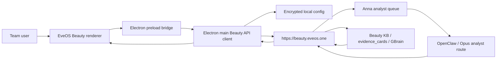

# EveOS Beauty

EveOS Beauty is the team client for Anna Beauty OS. It is built for BANILA CO
and future F&CO beauty brands: product planning, renewal strategy, market
follow-up, claims, hooks, ads, and evidence-backed decisions across KR, JP, and
US.

This repository is forked from `OpenCoworkAI/open-cowork`, but the product goal
is narrower and more governed: a Beauty OS cockpit over Anna's API and analyst
queue, not another broad autonomous desktop agent.

## What It Connects To

| Layer                      | Role                                                              |
| -------------------------- | ----------------------------------------------------------------- |
| `https://beauty.eveos.one` | Beauty API gateway for team clients.                              |
| Cloudflare Access          | Email allowlist and external team enrollment gate.                |
| Beauty API token           | Bearer token stored in Electron main-process storage.             |
| Anna analyst queue         | Max-thinking analyst execution behind the API.                    |
| Beauty KB / GBrain         | Evidence cards, source tables, wiki artifacts, and market memory. |

Team users should not need direct Anna machine access, SSH, Tailscale, local DB
paths, or OpenClaw workspace access.

## Core Workflow

1. Open the Beauty OS surface.
2. Configure the API base URL: `https://beauty.eveos.one`.
3. Save the Beauty API token once.
4. Run Health to verify gateway access.
5. Build an intent brief before analyst execution.
6. Queue an Anna analyst run.
7. Review observed facts, inference, citations, missing data warnings, and
   confidence.
8. Save and export Decision packets for team sharing.

## Current Beauty OS Surfaces

- API access panel for base URL, token save, and health check.
- Team access readiness panel for Cloudflare Access, token state, gateway
  status, and Anna isolation.
- Beauty command desk for market, brand, product, decision type, and question.
- Prompt brief review for making the "right prompt" explicit before expensive
  analyst work.
- Answer contract view separating observed facts from inference.
- Evidence packet browser for `evidence_cards` and citations, including source
  table, source URL, artifact path, confidence, layer, and missing-source
  warnings.
- Anna analyst queue mission control with running/waiting/failed counts, worker
  signal, visible queue rows, and stale snapshot warnings.
- Saved reports/history with Markdown export for Decision packets.

## Architecture



The renderer never receives the raw token. It only sees public config such as
`hasToken`. API calls and error redaction happen in Electron main.

## Source Choice

| Source                     | Decision                                                                                                                    |
| -------------------------- | --------------------------------------------------------------------------------------------------------------------------- |
| `OpenCoworkAI/open-cowork` | Implementation base: Electron, IPC/preload, settings, packaging, local persistence, MCP concepts, and desktop shell.        |
| `cowork-os/cowork-os`      | Product-pattern reference: Mission Control, timelines, artifact workbench, LLM-wiki direction, and CLI/control-plane ideas. |
| Anna Beauty OS             | Source of truth for Beauty KB, GBrain, crawlers, analyst execution, and evidence-backed answers.                            |

CoWork OS is intentionally not the base for this fork. Its broader everything-app
scope would compete with Anna. EveOS Beauty should expose Anna safely, not
replace it.

## Local Development

```bash
npm install
npm run rebuild:node
npm run dev
```

Useful verification commands:

```bash
npm run typecheck
npm run lint
npm run smoke:electron
npm run smoke:package-app
npm run smoke:beauty-real
npm test -- --run
```

Native modules are runtime-sensitive. Use:

```bash
npm run rebuild:node
npm run rebuild:electron
```

## Beauty API Setup

Default base URL:

```text
https://beauty.eveos.one
```

Team rollout sequence:

1. Add the user email to the Cloudflare Access policy for `beauty.eveos.one`.
2. Give the user the Beauty API token through a secure channel.
3. In EveOS Beauty, save the token in API access.
4. Run Health.
5. Confirm the Team access panel shows gateway and token readiness.

Do not commit tokens, cookies, tunnel credentials, or Cloudflare API keys.

For local smoke verification from a trusted shell, you can save the token into
the same encrypted app store without printing it:

```bash
EVEOS_BEAUTY_API_TOKEN='...' npm run beauty:save-token
```

Optionally set `EVEOS_BEAUTY_API_BASE_URL` to override the default
`https://beauty.eveos.one`.

After saving the token, run:

```bash
npm run smoke:beauty-real
```

The smoke command starts the Electron production smoke and then checks Beauty
API `/health` plus authenticated `/tools`. It reads either the encrypted
`beauty-api` app store or `EVEOS_BEAUTY_API_TOKEN`; it does not print the token.

For release readiness after `npm run build`, run:

```bash
npm run smoke:package-app
```

This launches the built `EveOS Beauty.app` with `--smoke-test` and verifies the
packaged Electron runtime and native modules.

## Security Model

- No direct Anna DB/files/SSH/Tailscale access from the client.
- No direct OpenClaw workspace access from the client.
- Bearer token is stored through the Electron main-process config path.
- Renderer gets only redacted/public config.
- Exported Decision packets are Markdown and should preserve citations while
  redacting secrets.
- Analyst execution should remain queued and observable rather than blocking the
  UI as if it were a normal chat request.

## Repository Landmarks

| Path                                     | Purpose                                                                      |
| ---------------------------------------- | ---------------------------------------------------------------------------- |
| `src/main/beauty/`                       | Beauty API client, config store, IPC handlers, and packet export/store.      |
| `src/renderer/components/beauty/`        | Beauty command desk, evidence browser, queue monitor, and team access UI.    |
| `src/shared/ipc-types.ts`                | Shared Beauty IPC contracts.                                                 |
| `tests/beauty-*`                         | Beauty API, packet, queue, evidence, preload, and renderer wiring tests.     |
| `docs/eveos/beauty-client-design.md`     | Goal/spec, taste read, architecture, and OpenCowork vs CoWork OS comparison. |
| `scripts/generate-eveos-beauty-icons.py` | Reproducible BANILA-style app icon generation.                               |

## Product Taste

The app should feel like a refined internal operating console:

- BANILA/F&CO rose, cream, graphite, and restrained accent language.
- Dense evidence-first layout for repeated operational use.
- No generic AI-purple gradients, decorative blobs, oversized marketing hero
  sections, or cute/kitsch beauty styling.
- Icons and controls should support work: health, queue, evidence, save, export,
  and access state.

## Current Limits

- Full installer/notarized package smoke still needs a local secure-token pass.
- Source checkout real-API smoke is available through `npm run smoke:beauty-real`.
- Analyst runs are intentionally not started in automated smoke tests.
- Team rollout depends on Cloudflare Access policy configuration outside this
  repository.
- TikTok crawling and Anna crawler setup are backend concerns, not client
  responsibilities.

## License

MIT. See `LICENSE`.
